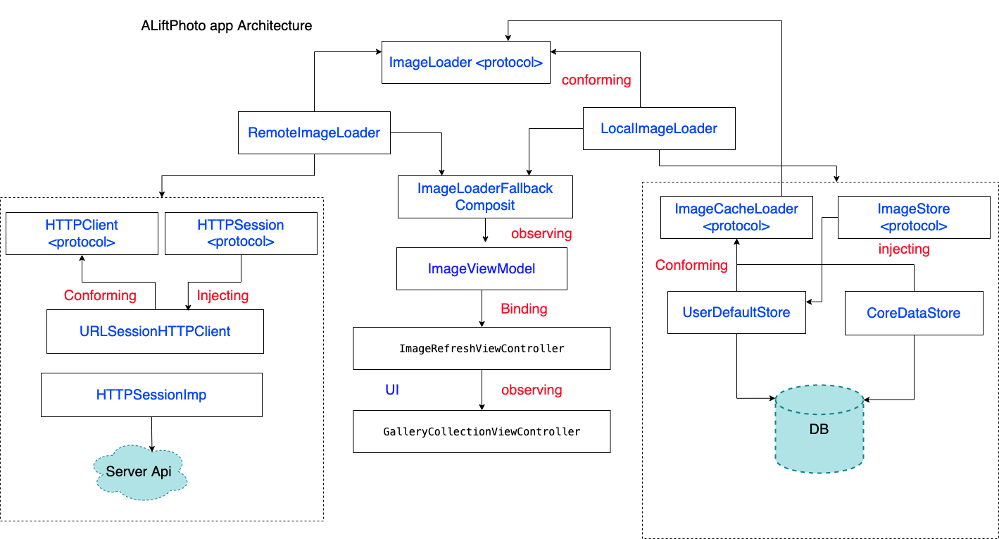

# PhotoApp
Architecture of ALift Assignment photo app

The application architecture is based on MVVM-C (Coordinator). There are few reasons to select this architecture.
 
● To create a reusable cross platform presentation layer we can also use the same ImageViewModel and all logic to get data in WatchKit as well as SwiftUI.
 
● Switching from UIkit to SwiftUI is become easier
 
● Mocking is easier in unit testing; we can easily mock the view model and test it.

Implemented SOLID principles which helps our code to make it modular and cleaner. So RemoteImageLoader and LocalImageLoader Open for extension we can easily switch to another Api library like alamofire and for Local we can easily switch to other stores like CoreData.
 
For transitioning between Screens I am using a coordinator pattern to inject all dependencies to View controller.
 
To compose a gallery view controller with all dependencies I am using composable which is like a factory you can find in the compose folder.
 
To decide when to load data from remote or local we have a Composite Fallback class which i.e ImageLoaderFallbackComposite (conforming ImageLoader protocol)
 
Binding of viewmodel into Viewcontroller done with UIRefreshControl Controller class.
